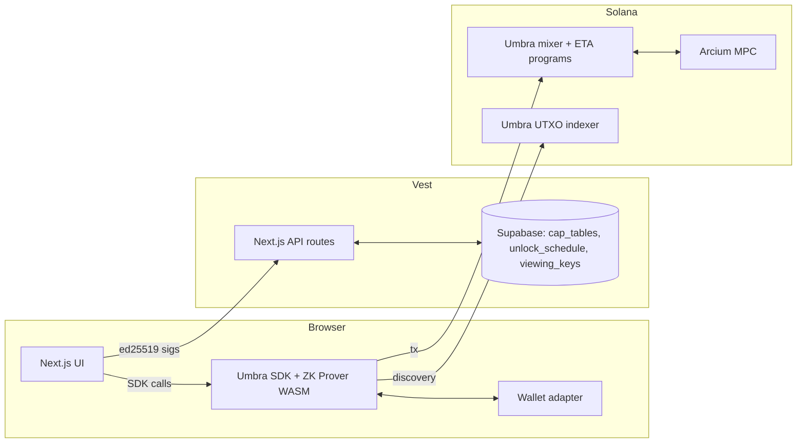

# vest — Private vesting on Solana

Cap tables were private for a reason. Vest is private team and investor token vesting on Solana, built on the [Umbra Privacy Protocol](https://umbraprivacy.com).

> Submission for the Umbra Side Track. Built during the Colosseum hackathon.

<!-- TODO: capture and embed `docs/screenshots/hero.png` during the polish pass. -->

## The problem

**Salary doxxing.** Today, every monthly USDC transfer to an engineer becomes a permanent, indexed, public record on Solana. Recruiters scrape it. So do journalists, lenders, and ex-spouses. The same is true for advisor cliffs, founder vests, and contractor retainers — every disbursement is a Solscan link.

**Unlock-day attacks.** Public schedules are also a phishing roadmap. The chain says exactly which wallet receives a six-figure amount on which date. A motivated attacker spins up a clone of the recipient's auth domain, drops a typo-squat one week before the unlock, and waits.

**Diligence leakage.** Acquirers, competitors, and analysts can read the cap table off-chain before any agreement is signed. A founder negotiating an LOI cannot present a clean cap-table snapshot — the chain has already shown the unfiltered version.

These three failure modes are the reason Solana protocols with serious finance functions don't run on-chain vesting today. They use spreadsheets and bank wires instead.

## What Vest does

1. **Founder creates an encrypted cap table.** Project name, mint, beneficiaries, schedule. Saved against a wallet-signed commitment hash.
2. **Treasury is shielded into an Umbra encrypted balance.** A single deposit moves the gross amount from the founder's ATA into a private balance.
3. **Receiver-claimable UTXOs are dispatched to beneficiaries.** One UTXO per unlock event, addressed to the beneficiary's wallet, fee-paid by the founder, time-gated by Vest's UI.
4. **Beneficiaries discover and claim privately.** They scan the Umbra mixer for UTXOs addressed to them and burn the nullifier to release tokens.
5. **Auditors receive scoped read access via Umbra's hierarchical viewing keys.** Master, per-mint, per-year, per-month — each level of disclosure is a real cryptographic key, not an application toggle.

## Why Umbra (Core Integration)

Vest is built end-to-end on the Umbra SDK. This section maps every screen to its underlying SDK call.

### Client construction

```typescript
import { getUmbraClient, createSignerFromWalletAccount } from "@umbra-privacy/sdk";

const signer = createSignerFromWalletAccount(wallet, account);
const client = await getUmbraClient({
  signer,
  network: "devnet",
  rpcUrl: process.env.NEXT_PUBLIC_SOLANA_RPC_URL!,
  rpcSubscriptionsUrl: process.env.NEXT_PUBLIC_SOLANA_RPC_SUBSCRIPTIONS_URL!,
  indexerApiEndpoint: "https://utxo-indexer.api-devnet.umbraprivacy.com",
  deferMasterSeedSignature: true,
});
```

`lib/umbra/client.ts` builds a single client per connected wallet and reuses it across registration, shielding, claiming, and viewing-key derivation.

### Registration (founder + beneficiary)

```typescript
import { getUserRegistrationFunction } from "@umbra-privacy/sdk";

const register = getUserRegistrationFunction({ client });
await register({
  confidential: true,   // X25519 key — required to receive
  anonymous: true,      // user commitment — required to claim
  callbacks: { /* per-step pre/post for the UI stepper */ },
});
```

Both founders and beneficiaries register with `anonymous: true`. The SDK's idempotent design means we call it on every session — already-completed steps no-op silently.

### Treasury shielding (encrypted balance deposit)

```typescript
import { getPublicBalanceToEncryptedBalanceDirectDepositorFunction } from "@umbra-privacy/sdk";

const deposit = getPublicBalanceToEncryptedBalanceDirectDepositorFunction({ client });
const result = await deposit(founderWallet, USDC_MINT, totalAmount, {
  awaitCallback: true,
});
// result.queueSignature is the public shield tx (visible amount + sender)
// result.callbackSignature lands when Arcium MPC re-encrypts the balance
```

Once shielded, only the founder's X25519 key can decrypt the balance. The Solscan trail shows the deposit amount but no future disbursement detail.

### UTXO creation (per unlock event)

```typescript
import { getEncryptedBalanceToReceiverClaimableUtxoCreatorFunction } from "@umbra-privacy/sdk";
import { getEncryptedBalanceToReceiverClaimableUtxoCreatorProver } from "@umbra-privacy/web-zk-prover";

const zkProver = getEncryptedBalanceToReceiverClaimableUtxoCreatorProver();
const createUtxo = getEncryptedBalanceToReceiverClaimableUtxoCreatorFunction(
  { client },
  { zkProver },
);

for (const row of schedule) {
  const result = await createUtxo({
    destinationAddress: row.beneficiaryWallet,
    mint: USDC_MINT,
    amount: row.amount,
  });
  // Persist commitment + tx sig in our DB; this is the on-chain anchor.
}
```

Each UTXO is a separate transaction with its own ZK proof generated in the browser via `@umbra-privacy/web-zk-prover`. The recipient is fixed at creation; the founder's involvement ends here.

### Beneficiary claim flow

```typescript
import {
  getClaimableUtxoScannerFunction,
  getReceiverClaimableUtxoToEncryptedBalanceClaimerFunction,
  getEncryptedBalanceToPublicBalanceDirectWithdrawerFunction,
  getUmbraRelayer,
} from "@umbra-privacy/sdk";
import { getClaimReceiverClaimableUtxoIntoEncryptedBalanceProver } from "@umbra-privacy/web-zk-prover";

// Discover
const scan = getClaimableUtxoScannerFunction({ client });
const { received } = await scan(0 as U32, 0 as U32);

// Claim into encrypted balance (mixer hides the link to the original deposit)
const claim = getReceiverClaimableUtxoToEncryptedBalanceClaimerFunction(
  { client },
  {
    zkProver: getClaimReceiverClaimableUtxoIntoEncryptedBalanceProver(),
    relayer: getUmbraRelayer({ apiEndpoint: relayerUrl }),
  },
);
await claim([received[0]]);

// Optional second hop: withdraw to public ATA
const withdraw = getEncryptedBalanceToPublicBalanceDirectWithdrawerFunction({ client });
await withdraw(beneficiaryWallet, USDC_MINT, amount);
```

The two-step path (claim into encrypted balance, then withdraw) is also Umbra's recommended privacy-preserving path: aggregating multiple UTXOs in the encrypted balance hides per-UTXO amounts before they exit.

### Hierarchical viewing keys (the differentiator)

```typescript
import {
  getMasterViewingKeyDeriver,
  getMintViewingKeyDeriver,
  getYearlyViewingKeyDeriver,
  getMonthlyViewingKeyDeriver,
} from "@umbra-privacy/sdk";

// Each level is a Poseidon-hashed BN254 field element scoped one step narrower.
const mvk = await getMasterViewingKeyDeriver({ client })();                   // all activity
const mintVk = await getMintViewingKeyDeriver({ client })(USDC_MINT);          // USDC, all time
const yearVk = await getYearlyViewingKeyDeriver({ client })(USDC_MINT, 2025n); // USDC, 2025
const monthVk = await getMonthlyViewingKeyDeriver({ client })(USDC_MINT, 2025n, 2n); // Feb 2025
```

These are real cryptographic scoping keys — the auditor with a monthly key cannot derive the yearly key, the master key, or any other mint's activity. Vest wraps each derived key under an HKDF-derived AES-GCM envelope keyed by the access token, so the DB never sees the plaintext key.

### Why these primitives map to vesting

- **Receiver-claimable UTXOs** = pull-claim semantics. The founder fires-and-forgets at unlock-creation time; the beneficiary controls timing and exit. There is no ongoing custody or signature obligation on the founder.
- **Hierarchical viewing keys** = real cryptographic scoping for auditors. The founder doesn't have to trust Vest's enforcement of "this auditor only sees Q1 2025" — Umbra's Poseidon hierarchy enforces it at the key level.
- **Encrypted balance** = treasury privacy *before* disbursement. The shielded balance hides the runway from competitors, the dispatch cadence from journalists, and per-beneficiary amounts from anyone scraping the chain.

## Architecture



### Design decisions

- **Pull-claim over push-disbursement.** The founder doesn't run a recurring job. Each unlock UTXO sits in the Umbra mixer until the beneficiary claims it. Stronger privacy on cadence (no push timing leak), simpler operations, and the founder set-and-forgets after dispatch.
- **Two-phase shielding** (encrypted-balance deposit, then mixer UTXO creation). Treasury becomes private before any UTXO is created, so a partial dispatch failure doesn't leak the cadence-of-recovery. Each UTXO is independently retryable.
- **Cap-table commitment hash.** Vest computes `sha256` over the canonicalised schedule and stores it on the `cap_tables` row. The founder's wallet signs the commitment at creation time. Future v2 can write the commitment into Umbra's `optionalData32` slot at deposit time for on-chain anchoring.
- **Viewing keys delivered via access-token envelopes.** The viewing-key bytes never enter our DB in plaintext. We derive an AES-GCM key from a 32-byte access token via HKDF-SHA256 (salt: `"vest:vk:v1"`, info: envelope id) and store only the ciphertext. The actual underlying credential is Umbra's Poseidon-hierarchy viewing key — the AES-GCM envelope is just an at-rest wrapping for the demo's distribution UX.

## Viewing keys

Vest's audit view supports four scopes, each a real Umbra viewing key derived from the founder's master seed:

- **Master** — full visibility, all tokens, all time. Use case: external auditor for an annual review.
- **Per-mint** — one token's activity across all time. Use case: a tax auditor only reviewing USDC.
- **Yearly** — one year's USDC activity. Use case: tax preparer for a specific tax year.
- **Monthly** — one month, one mint. Use case: M&A diligence with a tight scope.

The `/audit` page renders against the cap-table mirror in our database, scope-filtered server-side, with the actual derived BN254 viewing key displayed in the footer attestation. Once Umbra ships the auditor scanner SDK, the same page will swap to scanning on-chain ciphertexts directly.

<!-- TODO: docs/screenshots/audit-master.png, audit-monthly.png -->

## Trade-offs and v2

- **Tokens.** UI ships with USDC + SOL. Umbra supports more SPL + Token-2022 mints; v2 expands the token picker.
- **X25519 compliance grants.** v1 ships only mixer-pool viewing keys. v2 adds Umbra's X25519 grants for live encrypted-balance disclosure to a CFO or investor.
- **Public-ATA claims.** Beneficiaries currently claim through the encrypted balance and optionally withdraw to a public ATA. The destination + amount are visible at withdrawal time (the link to the original deposit is hidden). v2 supports persistent encrypted-balance holding.
- **No clawback.** v1 has no flow for off-boarded employees; once a UTXO is dispatched, it's the recipient's. v2 adds a sender-claimable UTXO path for clawback windows.
- **Cap-table edits.** Once shielded, the schedule is frozen. v2 supports append-only amendments (additional unlocks, additional beneficiaries) under a new commitment hash.

## Setup and run

### Prereqs

- Node 20+ (Node 19 minimum for `globalThis.crypto.subtle`)
- pnpm 9+
- Supabase project (free tier is fine)
- Devnet wallet with ~0.5 SOL + some devnet USDC
- Solana RPC + WebSocket endpoint (Helius, Triton, or any provider that supports devnet)

### Local setup

```bash
git clone https://github.com/sadiqsaidu/vest
cd vest
pnpm install
cp .env.local.example .env.local
# Fill in .env.local — Supabase URL + keys, your RPC endpoints,
# NEXT_PUBLIC_DEMO_RESET_WALLET if you want the /demo seed page enabled.
```

Apply the database schema:

```bash
# Either via the Supabase dashboard SQL editor, or:
supabase db push
```

The schema is at `docs/supabase-schema.sql`. It creates `cap_tables`, `unlock_schedule`, and `viewing_keys` with the appropriate indexes and check constraints.

### Run

```bash
pnpm dev
# http://localhost:3000
```

### Test mode

The cap-table create form has a **"seconds instead of months"** toggle. With it on, the unlock cadence collapses from months to seconds, so you can walk through the full schedule + claim flow in 5 minutes against your local devnet wallet. Production use leaves this off.

### Demo seed

Visit `/demo` while connected as the wallet you set in `NEXT_PUBLIC_DEMO_RESET_WALLET`. The page wipes the wallet's prior cap tables / viewing keys and seeds:

- 1 cap table — *Acme Protocol Token Plan*
- 12 unlocks across 3 beneficiaries
- 2 unlocks pre-marked as already claimed (with mock signatures)

After seeding, click **"Begin shielding"** to fire the real on-chain shield + UTXO creation flow. Generate viewing keys live during the recording.

## Deployed links

- **Live URL:** TODO: `https://vest-...vercel.app`
- **GitHub repo:** TODO: `https://github.com/<owner>/vest`
- **Demo video:** TODO: YouTube/Loom link
- **Devnet example:**
  - Shield tx: TODO
  - UTXO creation tx (sample): TODO
  - Claim tx (sample): TODO
- **Mainnet:** TODO if a small end-to-end run is captured; otherwise document devnet-only.

## Who would use this

- **CFO of a 50-person Solana DeFi protocol** running team token vesting in a project token + USDC. They want a clean monthly disbursement cadence without putting team comp on Solscan, and a way to hand a master viewing key to their auditor at year-end.
- **Founder of a stealth-mode startup** approaching acquisition with a staged cap-table disclosure: a master key for the board, a monthly key for diligence, a per-mint key for the buyer's tax counsel. None of these parties see anything outside their scope, and revocation is a single click.
- **Operations lead of a DAO** running grants vesting to confidential contributors (security researchers, legal counsel, anonymous engineers). The DAO needs the on-chain anchor for auditability without doxxing the recipients to anyone scraping the treasury.

---

Built on [Umbra](https://umbraprivacy.com), [Solana](https://solana.com), [Next.js](https://nextjs.org), [Supabase](https://supabase.com), and [Arcium](https://arcium.com).
